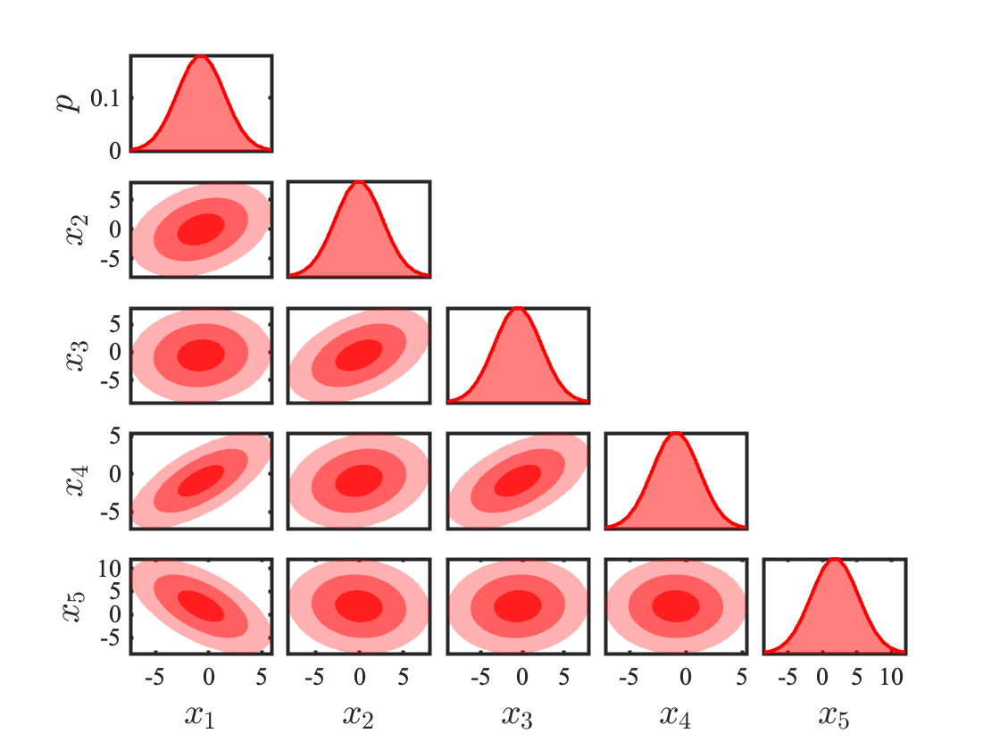

# plot_corner_pdf.m
This MATLAB function creates a corner plot of the discretized PDF represented by $X$ and $P$, where $X$ is the state coordinate matrix and $P$ is the probability at each of these coordinate points.  

$$
\begin{gather}
    X \in \mathbb{R}^{n\times d} \\
    P \in \mathbb{R}^{n\times 1} 
\end{gather}
$$

Please direct any questions to blhanson@ucsd.edu.   

